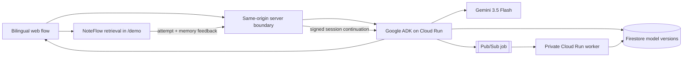
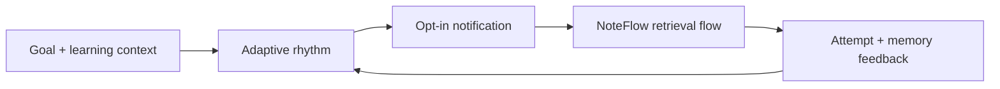

# NoteFlow Agent — The plan should move when the learner does

> Most learning tools ask, "What is due?"
> NoteFlow asks, "What can you genuinely learn next—and what should change after you try?"

**All Things Agentic Hackathon 2026 · Collaborative Partner track**

- Hosted demo: https://note-flow-agent-hackathon-2026.vercel.app (no account needed)
- Demo video: <YOUTUBE_URL>
- Architecture diagram: [docs/architecture.png](docs/architecture.png)
- Pre-existing work disclosure: [HACKATHON_DISCLOSURE.md](HACKATHON_DISCLOSURE.md)

NoteFlow Agent is a learning partner that turns a goal and messy notes into a study rhythm the learner can keep, generates retrieval cards from that evidence, and revises the rhythm from real retrieval feedback. It never shows a backlog, an overdue count, or a completion rate.

## Intended product loop

1. The learner describes a goal, source evidence, learning preferences, and real constraints in their own words.
2. The Agent asks only the clarifying questions that would change the plan.
3. The Agent infers a reviewable draft: goal, optional role baseline, themes, a continuous steady-to-sprint priority, session-duration range, study-reminder frequency, study pattern, energy window, and reminder preference.
4. The learner reviews or changes those settings, then explicitly starts the session. The ranges guide priority and study reminders; they never limit voluntary learning.
5. An optional study reminder brings the learner back; it does not create an overdue task.
6. NoteFlow starts a retrieval session and selects the next knowledge object from memory evidence and goal relevance.
7. The learner's attempt, stuck point, skip, and memory feedback return to the Agent.
8. The Agent revises timing, session load, knowledge scope, and the next study reminder. Longer analysis can continue asynchronously after the learner leaves.

```text
Goal + personal learning context
  → adaptive rhythm
  → notification
  → NoteFlow retrieval session
  → real memory evidence
  → Agent revises the rhythm
```

The learner profile is self-reported product context, not a medical, neurological, or psychological diagnosis.

## What changes from the original NoteFlow

| Original NoteFlow foundation | Hackathon Agent direction |
| --- | --- |
| Retrieval-first note and card system | Personal learning-rhythm partner |
| Deterministic Flow Engine chooses the next card | Agent decides when to invite learning and how much load to propose |
| Goal filters and interview sprint controls | Adaptive plan based on preferences, constraints, availability, and observed behavior |
| Feedback reschedules memory objects | Feedback also revises the Agent's future rhythm |
| User opens the app to begin | Notification brings the learner back at an appropriate time |

The original Flow Engine remains responsible for **what to retrieve now**. The Agent becomes responsible for **when to invite learning, why the rhythm should change, and how the plan adapts over time**.

## Product rules

- A learning plan is a rhythm, not a task backlog.
- Missing a notification never becomes an overdue obligation.
- The Agent may recommend session size, but it must not punish the learner for stopping.
- Retrieval evidence is more important than a personality label.
- The learner can inspect and change the assumptions used by the Agent.
- Notifications and background work must be opt-in and explainable.

## Current implementation status

### Working now

**Intake and planning**
- English/Chinese interface; generated content is locked to the language of the run
- Natural-language goal, unstructured notes, optional target date, and minutes per day — no fixed quotas up front
- Server-computed "today" and days-to-target injected into every Agent turn, so the model never infers the current date
- One clarifying question, asked only when the answer would change the plan (signed continuation session)

**Agent (Gemini 3.5 Flash · Google ADK · Cloud Run)**
- Single `LlmAgent` with two scoped tools: `persist_learning_model` and `queue_deep_analysis`
- Structured `planSettings`: pace bias, session range, reminder frequency, study pattern, energy window, themes, and 1–8 structured `retrievalCards` (theme, mode, prompt, hints, expected answer, note, language code)
- Persistence is enforced: a planning turn without a tool call is retried with tool choice forced (`beforeModelCallback`)
- Firestore: mutable `current` document plus an immutable version per revision
- Pub/Sub deep-analysis jobs (digest only) delivered to a private Cloud Run worker

**Learning workspace (`/demo`)**
- Goal-scoped state: each Agent plan gets its own skills, cards, and browser storage; no seed data leaks between goals
- Cards are generated per theme from the Agent's structured output; each card carries an `origin` (`agent` / `import` / `manual` / `prerequisite` / `gap`)
- Retrieval session with two deferral actions: move to end of session, or return to the pool
- Attempt outcome, hint depth, reaction time, and memory change sent back to the same Agent session; before/after rhythm shown to the learner
- Idle "plan set" state after a session — no re-planning required
- Note library with CSV/Anki import, visible alongside Agent-generated cards
- Opt-in calendar (`.ics`) export and browser reminder, only after a start time is confirmed

### What's next

- Per-card forgetting timelines so review and new cards compete inside a fixed daily budget that never grows
- A single home state with today's card budget as the only visible target; setup reduced to three questions
- Voice playback of reference phrases on `speak` cards via browser speech synthesis (recording already works)
- Coverage estimate at setup ("at 5 cards a day you'll cover about 60% by your date"), shown once
- Server-side reminders and cross-device continuity for signed-in learners
- Longitudinal adaptation across many sessions, and background-analysis results surfaced in the next session

The current build completes the P0 loop from learner context to rhythm, reminder, retrieval, feedback, and a visibly revised rhythm. Calendar reminders survive the browser through the learner's calendar; browser notifications are a lightweight opt-in companion, not a claim of production push delivery.

## Judge path (no account)

1. Open the hosted demo. English is default; 中文 is one click.
2. Enter a goal, at least one note or stuck point, an optional target date, and minutes per day. Select **Build my learning path**.
3. Watch the four-step trace. If the Agent asks one clarifying question, answer it below the trace.
4. Review the generated summary, then select **Review plan**. On the plan review page, inspect the pace, session range, themes, and target date, then select **Confirm this plan** — nothing starts yet.
5. On the plan-set home state, select **Start learning**. Answer each card before opening the note. Try **Skip for now · return to learning pool** on one card and **I got stuck** on another.
6. Select **End this session**. The Agent's revised rhythm and next invitation appear on the completion screen; a second immutable version is written to Firestore.
7. Select **Back to the plan** to return to the idle state. Open **Notes** to see Agent-generated and imported cards side by side.

`/account` belongs to the pre-existing product foundation and is not part of the public Vercel judging path. Supabase is not required for judging or guest practice.

## Where data lives

| Data | Current source of truth |
| --- | --- |
| Agent knowledge model, generated plan settings, immutable versions, and background results | Google Firestore |
| Public judge handoff and guest retrieval state | Current browser storage; the interface labels this explicitly |
| Supabase | Authentication only in the pre-existing account route |
| Cloudflare D1 | Pre-existing account workspace persistence; it is not mounted on the Vercel judge deployment |
| Initial `/demo` skills and cards | Disclosed pre-existing demo seed data in the repository |

The public flow is therefore intentionally hybrid, not a single disconnected database. Firestore proves Agent mutation; browser storage keeps the no-account judge Session usable without claiming cross-device continuity. Generated content is locked to the language used for that Agent run so an English interface cannot silently reuse a Chinese result, or vice versa.

## Google technology

| Technology | Current role |
| --- | --- |
| Gemini 3.5 Flash through Vertex AI | Interactive evidence reasoning and background analysis |
| Google ADK for TypeScript | Agent orchestration and scoped function tools |
| Cloud Run | Interactive ADK API service and separate private worker |
| Firestore | Current learning model, immutable model versions, and completed analyses |
| Pub/Sub | Safe-digest asynchronous analysis jobs delivered with OIDC |

## Reliability notes

- Structured output: every card requires `theme`, `mode`, `prompt`, `hintKeywords`, `expectedAnswer`, and `noteMarkdown`; `languageCode` is optional. The plan review reads the structured first card directly and never substitutes report prose.
- Tool schema is kept Vertex-compatible, including avoiding unsupported empty-literal enum constructs.
- If a planning turn returns a report without `persist_learning_model` or without at least one card, the proxy re-runs the turn with tool choice forced. A corrected response that still lacks a card fails clearly instead of creating an empty plan.
- Rate limit: 12 Agent runs per minute per IP on the proxy.

The browser never receives Google Cloud credentials, the Cloud Run URL, or the shared service token. A same-origin server route owns that boundary.

## Verified live-cloud evidence

The Google Agent stack is running in entrant-owned billing project `project-0069ddaa-e176-4b98-9db`.

- Firestore immutable mutation: `9aPqpj5FpIXwgGf89HVQ`
- Pub/Sub message: `21517632790505643`
- background status: `complete`
- completion time: `2026-08-22T17:43:24.168Z`

These identifiers prove the evidence-to-model-to-background-job path. The later P0 deployment additionally verified a live planning turn followed by an authenticated feedback continuation; both returned a persisted rhythm, next study reminder, and next practice. It does not claim production push-notification delivery.

The independent Vercel production deployment was also tested end to end on August 22, 2026. A public judge run returned `READY`, persisted immutable Firestore model version `8DopLuEwDZ4SVnk4eqyn`, and handed the Agent-selected retrieval prompt into `/demo?source=agent`.

## Hosted demo and Vercel boundary

The current submission URL is:

```text
https://note-flow-agent-hackathon-2026.vercel.app
```

Vercel may report two deployable directories in this repository:

1. **Import `NoteFlow-Agent-Hackathon-2026`** — this is the repository-root web experience.
2. **Do not import `hackathon-agent` as a second Vercel website** — that directory is the protected Google ADK backend and belongs on Cloud Run.

Configure these as server-only variables on the root web project:

```text
NOTEFLOW_AGENT_URL
NOTEFLOW_AGENT_SHARED_SECRET
```

Do not expose either value with a `NEXT_PUBLIC_` prefix. A Vercel import is not considered complete until the root page, `/api/hackathon-agent`, the live Agent run, and the handoff to `/demo` have all been verified.

The old `chatgpt.site` deployment is not the current submission URL.

## Architecture

Current deployed Agent path:



Target experience extension:



See the detailed [current architecture and trust boundaries](docs/HACKATHON_ARCHITECTURE.md).

## Run the web app locally

Prerequisites: Node.js 22.13+ and pnpm.

```bash
pnpm install
pnpm dev
```

Open `http://localhost:3000`. Without the server-only Agent variables, the interface uses clearly labeled preview output.

## Run the Google ADK service locally

Prerequisites: Node.js 24.13+, pnpm 11.19+, a Google Cloud project, and Application Default Credentials.

```bash
cd hackathon-agent
pnpm --ignore-workspace install
pnpm test
pnpm dev
```

Confirm `http://localhost:8000/list-apps` returns `["agent"]`. Complete backend instructions are in the [Agent service README](hackathon-agent/README.md).

## Validate

```bash
pnpm test
pnpm lint
pnpm exec tsc --noEmit
```

## Transparent development record

The earlier NoteFlow product is disclosed as pre-existing work. The repository retains its history and does not present the retrieval foundation as contest-period development.

- [Pre-existing work and claim boundary](HACKATHON_DISCLOSURE.md)
- [Dated, commit-linked development log](HACKATHON_DEVLOG.md)
- [Architecture and contest technology mapping](docs/HACKATHON_ARCHITECTURE.md)
- [Google Agent service and reproduction steps](hackathon-agent/README.md)
- [Submission readiness checklist](HACKATHON_SUBMISSION_CHECKLIST.md)
- Pre-contest baseline: `c42c840c2d881207ed6763a3280d198bc1189bfc`

The stable pre-contest product remains in the original [`Dollars7/NoteFlow`](https://github.com/Dollars7/NoteFlow/tree/main) repository.

> **Plan the rhythm. Enter the Flow. Remember.**

## Submission materials

- Devpost: <DEVPOST_URL>
- Demo video (≤4 min, English subtitles): <YOUTUBE_URL>
- Build story: <LINKEDIN_ARTICLE_URL>
- Architecture: `docs/architecture.png`
- Pre-existing work: `HACKATHON_DISCLOSURE.md` · Dev log: `HACKATHON_DEVLOG.md`
