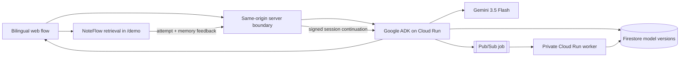
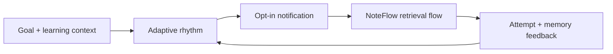

# NoteFlow Agent — Build a learning rhythm that adapts to you

> **Plan the rhythm, not the backlog. Let NoteFlow choose the next retrieval.**

This is the standalone submission repository for the **2026 All Things Agentic Hackathon**, entered in the **Collaborative Partner** category.

Repository: [`Dollars7/NoteFlow-Agent-Hackathon-2026`](https://github.com/Dollars7/NoteFlow-Agent-Hackathon-2026) · submission branch: `main`

Hosted demo: **[note-flow-agent-hackathon-2026.vercel.app](https://note-flow-agent-hackathon-2026.vercel.app)**

NoteFlow Agent is intended to learn **when and how a person can study sustainably**, create a personal learning rhythm, invite the learner back at the right moment, and then use the existing NoteFlow retrieval flow to decide what should be practiced.

It is not meant to be a pasted-notes report generator. The Agent should adapt the plan from real learning behavior.

## Intended product loop

1. The learner describes a goal, source evidence, learning preferences, and real constraints in their own words.
2. The Agent asks only the clarifying questions that would change the plan.
3. The Agent infers a reviewable draft: goal, optional role baseline, themes, a continuous steady-to-sprint priority, session-duration range, study-reminder frequency, study pattern, energy window, and reminder preference.
4. The learner reviews or changes those settings, then explicitly starts the session. The ranges guide priority and study reminders; they never limit voluntary learning.
5. An optional study reminder brings the learner back; it does not create an overdue task.
6. NoteFlow starts a retrieval session and selects the next knowledge object from memory evidence and goal relevance.
7. The learner's attempt, stuck point, skip, and memory feedback return to the Agent.
8. The Agent revises timing, session load, knowledge scope, and the next study reminder. Longer analysis can continue asynchronously after the learner leaves.

```text
Goal + personal learning context
  → adaptive rhythm
  → notification
  → NoteFlow retrieval session
  → real memory evidence
  → Agent revises the rhythm
```

The learner profile is self-reported product context, not a medical, neurological, or psychological diagnosis.

## What changes from the original NoteFlow

| Original NoteFlow foundation | Hackathon Agent direction |
| --- | --- |
| Retrieval-first note and card system | Personal learning-rhythm partner |
| Deterministic Flow Engine chooses the next card | Agent decides when to invite learning and how much load to propose |
| Goal filters and interview sprint controls | Adaptive plan based on preferences, constraints, availability, and observed behavior |
| Feedback reschedules memory objects | Feedback also revises the Agent's future rhythm |
| User opens the app to begin | Notification brings the learner back at an appropriate time |

The original Flow Engine remains responsible for **what to retrieve now**. The Agent becomes responsible for **when to invite learning, why the rhythm should change, and how the plan adapts over time**.

## Product rules

- A learning plan is a rhythm, not a task backlog.
- Missing a notification never becomes an overdue obligation.
- The Agent may recommend session size, but it must not punish the learner for stopping.
- Retrieval evidence is more important than a personality label.
- The learner can inspect and change the assumptions used by the Agent.
- Notifications and background work must be opt-in and explainable.

## Current implementation status

### Working now

- default-English public experience with an in-place Chinese switch;
- no-account judging and guest-practice path;
- natural-language goal, unstructured evidence, self-described learning preferences, and real-constraint intake without requiring fixed quotas first;
- Agent-generated, learner-editable plan settings: inferred goal, optional role baseline, themes, continuous steady-to-sprint priority, session-duration range, study-reminder frequency, study pattern, energy window, and reminder preference;
- an explicit plan-review boundary before the learner starts the Agent-selected retrieval;
- Agent-generated sustainable rhythm, plan settings, and next study reminder persisted with the knowledge model in Firestore;
- a signed continuation session for a real decision-changing clarification when one is necessary;
- Gemini 3.5 Flash reasoning through Google ADK;
- Firestore current-model mutation plus immutable versions;
- Pub/Sub asynchronous analysis delivered to a private Cloud Run worker;
- direct handoff from an Agent-selected retrieval prompt into the existing NoteFlow practice flow;
- two explicit card-defer actions: move to the end of the current session, or skip for now and return to the future learning pool;
- actual retrieval outcome, hint depth, reaction time, and memory change returned to the same Google Agent session;
- visible before-and-after rhythm changes plus the revised next study reminder;
- opt-in downloadable calendar reminder and browser reminder activation;
- transparent preview labeling when the live Agent connection is absent.

### Required after P0

- durable server push or email reminders that still arrive after every NoteFlow tab is closed;
- account-linked rhythm continuity across devices (the no-account judge handoff remains local to one browser);
- longitudinal adaptation across several completed sessions rather than one immediate feedback turn;
- completed background analysis reflected in the learner's next session.

The current build completes the P0 loop from learner context to rhythm, reminder, retrieval, feedback, and a visibly revised rhythm. Calendar reminders survive the browser through the learner's calendar; browser notifications are a lightweight opt-in companion, not a claim of production push delivery.

## Current working judge path

No account is required.

1. Open the [hosted demo](https://note-flow-agent-hackathon-2026.vercel.app) (the root page and `/hackathon` show the same judge flow).
2. Keep English or switch the same interface to Chinese.
3. Describe the learning goal and at least one note, question, or stuck point. Learning preferences and constraints are optional under **More settings**.
4. Run NoteFlow Agent and review the concise plan summary. The full Agent report remains collapsed under **Agent details and audit trail**.
5. Optionally add the study reminder to a calendar or enable the browser reminder.
6. Select **Review plan**. NoteFlow opens `/demo` without starting a learning session.
7. Review the goal, priority slider, and Session-length sliders. Reminder frequency, study pattern, timing, themes, and optional role baseline remain under **More settings**.
8. Select **Start this session** to begin the Agent-selected retrieval card.
9. During practice, **Later this session · move to queue end** rotates a card only when another card exists; **Skip for now · return to learning pool** removes it from this session. With one card, Skip ends the session and returns the card to the future pool.
10. Complete the retrieval feedback. The same Google Agent session receives the evidence and shows the rhythm before and after its revision.

`/account` belongs to the pre-existing product foundation and is not part of the public Vercel judging path. Supabase is not required for judging or guest practice.

## Where data lives

| Data | Current source of truth |
| --- | --- |
| Agent knowledge model, generated plan settings, immutable versions, and background results | Google Firestore |
| Public judge handoff and guest retrieval state | Current browser storage; the interface labels this explicitly |
| Supabase | Authentication only in the pre-existing account route |
| Cloudflare D1 | Pre-existing account workspace persistence; it is not mounted on the Vercel judge deployment |
| Initial `/demo` skills and cards | Disclosed pre-existing demo seed data in the repository |

The public flow is therefore intentionally hybrid, not a single disconnected database. Firestore proves Agent mutation; browser storage keeps the no-account judge Session usable without claiming cross-device continuity. Generated content is locked to the language used for that Agent run so an English interface cannot silently reuse a Chinese result, or vice versa.

## Google technology

| Technology | Current role |
| --- | --- |
| Gemini 3.5 Flash through Vertex AI | Interactive evidence reasoning and background analysis |
| Google ADK for TypeScript | Agent orchestration and scoped function tools |
| Cloud Run | Interactive ADK API service and separate private worker |
| Firestore | Current learning model, immutable model versions, and completed analyses |
| Pub/Sub | Safe-digest asynchronous analysis jobs delivered with OIDC |

The browser never receives Google Cloud credentials, the Cloud Run URL, or the shared service token. A same-origin server route owns that boundary.

## Verified live-cloud evidence

The Google Agent stack is running in entrant-owned billing project `project-0069ddaa-e176-4b98-9db`.

- Firestore immutable mutation: `9aPqpj5FpIXwgGf89HVQ`
- Pub/Sub message: `21517632790505643`
- background status: `complete`
- completion time: `2026-08-22T17:43:24.168Z`

These identifiers prove the evidence-to-model-to-background-job path. The later P0 deployment additionally verified a live planning turn followed by an authenticated feedback continuation; both returned a persisted rhythm, next study reminder, and next practice. It does not claim production push-notification delivery.

The independent Vercel production deployment was also tested end to end on August 22, 2026. A public judge run returned `READY`, persisted immutable Firestore model version `8DopLuEwDZ4SVnk4eqyn`, and handed the Agent-selected retrieval prompt into `/demo?source=agent`.

## Hosted demo and Vercel boundary

The current submission URL is:

```text
https://note-flow-agent-hackathon-2026.vercel.app
```

Vercel may report two deployable directories in this repository:

1. **Import `NoteFlow-Agent-Hackathon-2026`** — this is the repository-root web experience.
2. **Do not import `hackathon-agent` as a second Vercel website** — that directory is the protected Google ADK backend and belongs on Cloud Run.

Configure these as server-only variables on the root web project:

```text
NOTEFLOW_AGENT_URL
NOTEFLOW_AGENT_SHARED_SECRET
```

Do not expose either value with a `NEXT_PUBLIC_` prefix. A Vercel import is not considered complete until the root page, `/api/hackathon-agent`, the live Agent run, and the handoff to `/demo` have all been verified.

The old `chatgpt.site` deployment is not the current submission URL.

## Architecture

Current deployed Agent path:



Target experience extension:



See the detailed [current architecture and trust boundaries](docs/HACKATHON_ARCHITECTURE.md).

## Run the web app locally

Prerequisites: Node.js 22.13+ and pnpm.

```bash
pnpm install
pnpm dev
```

Open `http://localhost:3000`. Without the server-only Agent variables, the interface uses clearly labeled preview output.

## Run the Google ADK service locally

Prerequisites: Node.js 24.13+, pnpm 11.19+, a Google Cloud project, and Application Default Credentials.

```bash
cd hackathon-agent
pnpm --ignore-workspace install
pnpm test
pnpm dev
```

Confirm `http://localhost:8000/list-apps` returns `["agent"]`. Complete backend instructions are in the [Agent service README](hackathon-agent/README.md).

## Validate

```bash
pnpm test
pnpm lint
pnpm exec tsc --noEmit
```

## Transparent development record

The earlier NoteFlow product is disclosed as pre-existing work. The repository retains its history and does not present the retrieval foundation as contest-period development.

- [Pre-existing work and claim boundary](HACKATHON_DISCLOSURE.md)
- [Dated, commit-linked development log](HACKATHON_DEVLOG.md)
- [Architecture and contest technology mapping](docs/HACKATHON_ARCHITECTURE.md)
- [Google Agent service and reproduction steps](hackathon-agent/README.md)
- [Submission readiness checklist](HACKATHON_SUBMISSION_CHECKLIST.md)
- Pre-contest baseline: `c42c840c2d881207ed6763a3280d198bc1189bfc`

The stable pre-contest product remains in the original [`Dollars7/NoteFlow`](https://github.com/Dollars7/NoteFlow/tree/main) repository.

> **Plan the rhythm. Enter the Flow. Remember.**
