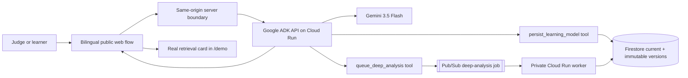

# NoteFlow Agent — Turn evidence into retrieval practice

> **The system carries decision cost. The learner carries retrieval cost.**

This is the standalone submission repository for the **2026 All Things Agentic Hackathon**, entered in the **Collaborative Partner** category.

Repository: [`Dollars7/NoteFlow-Agent-Hackathon-2026`](https://github.com/Dollars7/NoteFlow-Agent-Hackathon-2026) · submission branch: `main`

NoteFlow Agent reads a learner's goal and messy evidence, identifies the highest-value gap, persists an updated learning model, queues deeper asynchronous analysis, and turns its recommendation into an immediate retrieval exercise. It is a learning loop, not a planning-only chatbot.

## Judge path

No account is required for the public judging flow.

1. Open the root page or `/hackathon`.
2. Keep English, the first-visit default, or switch the same interface to Chinese.
3. Enter a learning goal, paste evidence, and optionally add one clarification.
4. Run NoteFlow Agent once.
5. Review the visible Agent trace, diagnosis, learning-model mutation, and next retrieval move.
6. Select **Practice the next step**.
7. NoteFlow opens `/demo`, creates a real retrieval card from the Agent handoff, and starts the learning attempt immediately.

`/account` is an optional personal-account route. Supabase configuration is not needed for judging or guest practice.

## Why it is agentic

The Agent does more than generate text:

- reasons over the goal, source evidence, and learner clarification with Gemini;
- calls an auditable Firestore tool that updates the current model and creates an immutable version;
- calls a Pub/Sub tool that queues a safe-digest deep-analysis job;
- lets a private Cloud Run worker perform the asynchronous analysis and write the completed result back to Firestore;
- returns one focused diagnosis and one retrieval move;
- hands that move into the existing retrieval engine as an actionable practice card.

## Google technology

| Technology | Role in NoteFlow Agent |
| --- | --- |
| Gemini 3.5 Flash through Vertex AI | Goal-and-evidence reasoning in the interactive Agent and background analysis |
| Google ADK for TypeScript | Agent orchestration and function tools |
| Cloud Run | Interactive ADK API service and separate private background worker |
| Firestore | Current learning model, immutable model versions, and completed analyses |
| Pub/Sub | Asynchronous deep-analysis jobs delivered to the private worker with OIDC |

The browser never receives Google Cloud credentials, the Cloud Run service URL, or the shared service token. A same-origin server route owns that boundary.

## Verified live-cloud evidence

The Google Agent stack is running in the entrant-owned billing project `project-0069ddaa-e176-4b98-9db`.

A real end-to-end run produced:

- Firestore immutable mutation: `9aPqpj5FpIXwgGf89HVQ`
- Pub/Sub message: `21517632790505643`
- background status: `complete`
- completion time: `2026-08-22T17:43:24.168Z`

The public frontend is currently being moved away from the temporary `chatgpt.site` host to an independent GitHub-connected domain. Until that compatible server deployment is complete, the repository is the source of truth; no obsolete host is presented as the submission demo.

## Architecture



See the detailed [architecture and trust boundaries](docs/HACKATHON_ARCHITECTURE.md).

## Run the web app locally

Prerequisites: Node.js 22.13+ and pnpm.

```bash
pnpm install
pnpm dev
```

Open `http://localhost:3000`. If the server-only Agent variables are absent, the interface remains usable in an explicitly labeled preview mode and never represents sample output as a live Gemini response.

For a compatible server deployment, configure:

```text
NOTEFLOW_AGENT_URL
NOTEFLOW_AGENT_SHARED_SECRET
```

The optional `/account` route additionally accepts the public Supabase variables documented in [authentication setup](docs/AUTH_SETUP.md).

## Run the Google ADK service locally

Prerequisites: Node.js 24.13+, pnpm 11.19+, a Google Cloud project, and Application Default Credentials.

```bash
cd hackathon-agent
pnpm --ignore-workspace install
pnpm test
pnpm dev
```

Confirm that `http://localhost:8000/list-apps` returns `["agent"]`. Complete setup and Cloud Run instructions are in the [Agent service README](hackathon-agent/README.md).

## Validate

```bash
pnpm test
pnpm lint
pnpm exec tsc --noEmit
```

## Transparent development record

NoteFlow existed before the contest. The repository preserves that history and does not present the earlier product foundation as hackathon-period work.

- [Pre-existing work and claim boundary](HACKATHON_DISCLOSURE.md)
- [Dated, commit-linked development log](HACKATHON_DEVLOG.md)
- [Architecture and contest technology mapping](docs/HACKATHON_ARCHITECTURE.md)
- [Google Agent service and reproduction steps](hackathon-agent/README.md)
- [Submission readiness checklist](HACKATHON_SUBMISSION_CHECKLIST.md)
- Pre-contest baseline: `c42c840c2d881207ed6763a3280d198bc1189bfc`

### Pre-existing foundation

- note library and import tools;
- retrieval-first learning workspace and deterministic scheduler;
- goal controls, authentication, D1 persistence, and visual identity.

### Contest-period work claimed by this entry

- public bilingual Collaborative Partner experience;
- Gemini 3.5 Flash and Google ADK Agent behavior;
- Firestore mutation history and Pub/Sub background analysis;
- Cloud Run services and their authenticated boundary;
- direct Agent-to-practice handoff;
- contest architecture, evaluation evidence, and reproducibility documentation.

The stable pre-contest product remains in the original NoteFlow repository on [`main`](https://github.com/Dollars7/NoteFlow/tree/main). This standalone repository preserves the inherited Git history and the documented baseline instead of resetting or concealing the pre-existing work.

> **Don't plan. Retrieve. Remember.**
