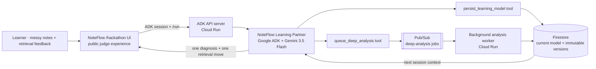

# NoteFlow Agent architecture

The hackathon entry separates the pre-existing web foundation from the contest-period Google agent system.

## Trust boundaries

- The browser never receives Gemini or Google Cloud credentials.
- Cloud Run uses its service identity and Application Default Credentials.
- Pub/Sub messages contain only a safe source digest, not raw private notes.
- Each model mutation writes a current document and a separate immutable version.
- The interface labels deterministic preview output and never presents it as Gemini output.

## Contest technology mapping

| Requirement | Implementation |
| --- | --- |
| Gemini 3.5+ | `gemini-3.5-flash` through Vertex AI |
| Google Agent Framework | Google ADK for TypeScript |
| Google Cloud infrastructure | Cloud Run, Firestore, and Pub/Sub |
| Beyond a chat loop | Tool-driven knowledge mutation and asynchronous background analysis |
| Captures feedback | Session clarification and persistent learning-model versions |
